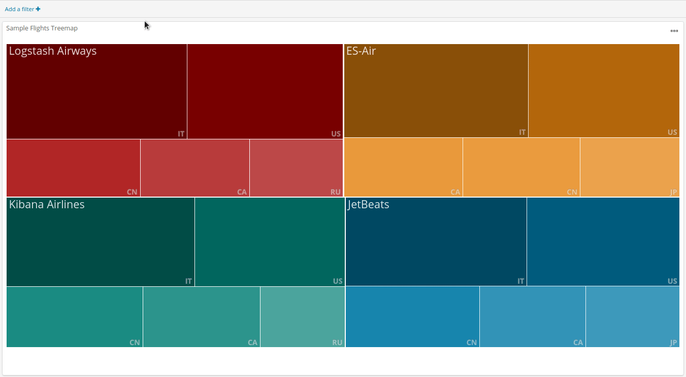

# Treemap visualization for Kibana

A treemap visualization for Kibana. Tested with Kibana 6.5.2.

Note: This is still work in progress.

Similar to a pie chart, this visualization displays the proportions of values within a metric. 
Sub-bucketing enables the metric to be split again, on proportions of another metric.
Treemaps are used to display hierarchical structures, just like parent child relations. 
The advantage of treemaps over pie charts, is the fact that the human perception is not very good at comparing segments of a circular structure.

The example above shows the treemap used on Kibanas sample flight data. 
The top level of the treemap shows the carriers.
When a carrier is selected, the next level in the treemap shows how the carriers are divided in terms of destination countries.
Again, when a destination country is selected, the next level shows the weather of the destination countries, and so on and so forth.

- [Mentions](#mentions)
- [Compatibility](#compatibility)
- [Issues](#issues)
<!--- - [Installation](#installation) --->
<!--- - [Uninstall](#uninstall) --->
<!--- - [Usage](#usage) --->
<!--- - [Options](#options) ---> 

## Mentions

Thanks go out to user [@ganeshv](https://github.com/ganeshv), who published [this beautiful zoomable treemap for d3](http://bl.ocks.org/ganeshv/6a8e9ada3ab7f2d88022), which this plugin is based on. 
The [initial zoomable treemap](https://bost.ocks.org/mike/treemap/) was published by Mike Bostock.

## Compatibility
This plugin is compatible with the following versions of Kibana:

* 6.5.2

## Issues
Please file issues [here](https://github.com/bgeVam/kibana_treemap_visualization/issues).
